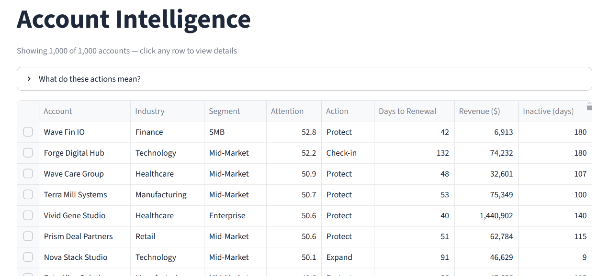
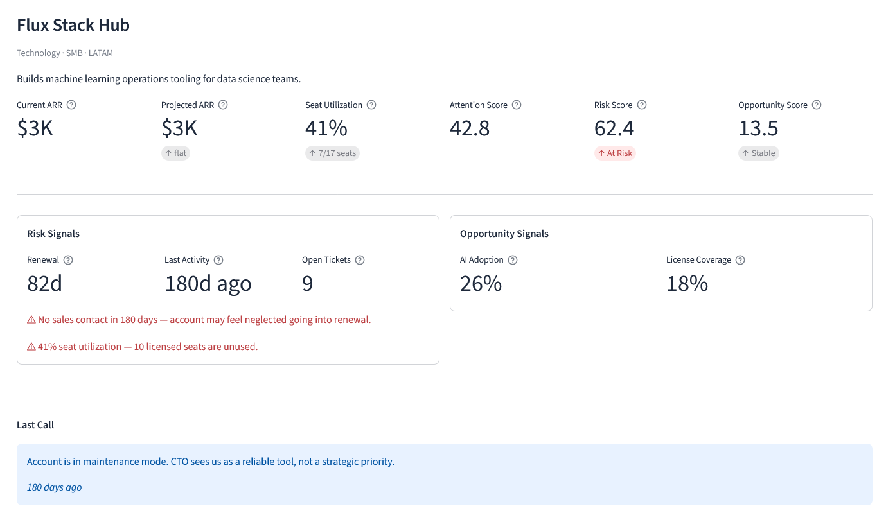
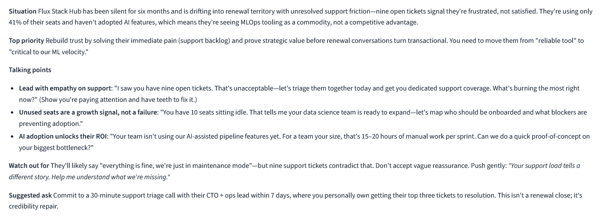
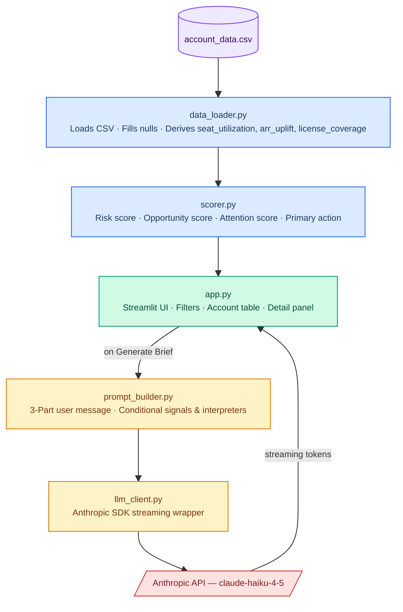

# Account Intelligence App

An AI-powered tool that helps Account Executives answer two questions: **"Which accounts need my attention today?"** and **"What should I know before my next meeting?"** It scores 1,000 accounts across risk and expansion signals, then generates a streaming meeting-prep brief on demand using Claude.

---

## What the App Does

The app has two layers:

**1. Account prioritization table.** Every account is scored on risk and expansion opportunity and ranked by a composite attention score. The table shows account name, industry, segment, attention score, days to renewal, revenue, and days since last sales activity. Clicking any row opens the detail panel.



Each account gets a single **action directive** derived from its risk and opportunity labels:

| Action | Meaning |
|---|---|
| **Protect** | At-risk account — make contact immediately |
| **Check-in + Expand** | Risk signals present but strong expansion potential |
| **Check-in** | Early warning signs — proactive outreach needed |
| **Expand** | Healthy account ready for an upsell conversation |
| **Grow** | Positive momentum — nurture toward expansion |
| **Monitor** | No immediate action needed |

The sidebar lets AEs filter by action, segment, and region, and sort by attention score, renewal date, revenue, or days since activity.

**2. Account detail panel.** Selecting a row shows a full breakdown: six header metrics (current ARR, projected ARR, seat utilization, attention score, risk score, opportunity score), a risk signals card (renewal countdown, last activity, open tickets, and contextual warnings), an opportunity signals card (AI adoption, license coverage, and expansion highlights), and the last call transcript.



At the bottom, a **Generate Meeting Brief** button streams a structured 5-section brief from Claude in real time — situation, top priority, talking points, watch out for, and a suggested ask. The brief is cached per account so switching between rows doesn't re-generate it.



---

## Prerequisites

- Python 3.10 or newer
- An [Anthropic API key](https://console.anthropic.com/)

---

## Setup

```bash
# 1. Clone the repo and enter the directory
git clone https://github.com/dcaled/account-intelligence-app.git
cd account-intelligence-app

# 2. Add the data file
# Copy account_data.csv into the project root (the same folder as app.py)
# The file is provided separately and is not committed to the repository

# 3. Create and activate a conda environment
conda create -n account-intelligence python=3.11 -y
conda activate account-intelligence

# 4. Install dependencies
pip install -r requirements.txt

# 5. Add your API key
cp .env.example .env
# Open .env and replace "your_api_key_here" with your actual key

# 6. Run the app
streamlit run app.py
```

The app will open at `http://localhost:8501` and load all 1,000 accounts automatically.

---

## How Scoring Works

### Data layer enrichment

The raw CSV has 16 columns. `data_loader.py` derives 7 additional fields before any scoring happens:

| Derived field | Source columns | Purpose |
|---|---|---|
| `seat_utilization` | `nr_active_users / nr_licensed_seats` | Core risk and opportunity signal |
| `arr_uplift` | `revenue_end_of_quarter / current_revenue` | Revenue trajectory ratio used by both scores |
| `license_coverage` | `nr_licensed_seats / nr_employees` | Expansion whitespace signal |
| `unused_seats` | `nr_licensed_seats − nr_active_users` | Display metric in the UI |
| `has_transcript` | `call_transcript_summary` not null | Controls conditional prompt section |
| `contraction_signal` | `arr_uplift < 1.0` | Flags accounts with projected revenue decline |
| `expansion_signal` | `arr_uplift > 1.0` | Flags accounts with projected revenue growth |

Null values in `days_since_last_sales_activity` are filled with the dataset maximum (worst-case inactivity). This avoids silently dropping accounts with missing data.

### AE Prioritization Framework

The framework splits accounts into two buckets — those that need **protecting** and those ready to **grow** — and stack-ranks within each by revenue at stake.

**Protect first (churn prevention).** Risk signals point to accounts where inaction has a cost:

- **Renewal urgency** gets the highest weight (30%) because a renewal that slips without a conversation is an immediate, guaranteed loss. The signal is continuous — the closer the renewal date, the higher the score — normalized against the portfolio's furthest renewal (270 days), which means every account is prioritized relative to the actual book, not an arbitrary cutoff.
- **Sales inactivity** (25%) is a leading indicator of relationship decay. By the time an account goes quiet, dissatisfaction has usually been building for weeks — and accounts with no recent contact are harder to retain because the relationship hasn't been maintained.
- **Support ticket volume** (20%) is both a retention risk and a negotiation liability. An AE walking into a renewal with 8 open tickets will face pushback before the commercial conversation even starts.
- **Low seat utilization** (15%) gives procurement an obvious cost-reduction argument at renewal. An account paying for seats nobody uses will cite that number.
- **ARR contraction** (10%) carries the lowest weight because it's a lagging signal — if the model is already projecting decline, the root causes (utilization, activity, tickets) are likely already captured by the signals above. (Computed as `1 − revenue_end_of_quarter / current_revenue`; the signal scales proportionally to the size of the decline, not just whether one exists.)

**Grow second (expansion).** Opportunity signals identify where an upsell conversation has natural tailwind:

- **AI adoption** (35%) is the strongest signal because it directly measures value realization. An account actively using AI features is getting ROI and is more likely to want more.
- **EOQ revenue uplift** (25%) means the account's own projected revenue is trending up — the expansion conversation has momentum rather than needing to be forced. (This is the mirror of ARR contraction in the risk score: both derive from `revenue_end_of_quarter / current_revenue`, but uplift fires when EOQ projection exceeds current ARR, contraction fires when it falls below. They can never both fire for the same account.)
- **Seat saturation** (25%) is the clearest upsell trigger: an account at 90% utilization has an organic need for more seats. The ask is natural, not a push.
- **License coverage** (15%) captures whitespace — most of the company isn't on the platform yet. The opportunity is real, but converting it requires more effort than a seat saturation upsell, so it carries a lower weight.

**How to use the Account prioritization table.** The default sort by attention score surfaces the most urgent accounts first. A few common workflows:

- **Start of week:** scan the top 10 by attention score and check the Action column — any "Protect" account in that list needs a call scheduled before anything else.
- **Renewal planning:** switch the sort to Renewal Date to see who's coming up soonest. Cross-reference with risk score to find accounts that look quiet but are approaching renewal.
- **Expansion pipeline:** filter the Action column to "Expand" or "Grow" to isolate accounts where the signals support an upsell conversation, then sort by Revenue to prioritize by deal size.
- **Segment or regional focus:** use the sidebar filters to narrow to a specific segment or region before reviewing.

This framework directly maps to the two scores below.

---

Every account gets two independent scores, each 0–100. Both are always visible so the AE understands _why_ an account surfaced.

### Risk Score — "Is this account at risk?"

| Signal | Weight | Logic |
|---|---|---|
| Renewal urgency | 30% | Normalized to dataset max (270 days = 0 score); accounts renewing sooner score proportionally higher |
| Sales inactivity | 25% | Normalized to dataset max (180 days = full score) |
| Support ticket volume | 20% | Calibrated to 99th percentile (~13 tickets) |
| Low seat utilization | 15% | Penalty kicks in only below 50% utilization |
| ARR contraction | 10% | Continuous: scales proportionally to the size of the projected decline (`1 − EOQ_ARR / current_ARR`) |

**Labels:** 
- 50–100 → At Risk 
- 30–49 → Needs Check-in 
- 0–29 → Healthy

The renewal urgency signal has the highest weight (30%) because a missed renewal is an immediate, guaranteed loss. The normalization ceiling is derived from the dataset maximum so the score reflects each account's relative urgency within the actual portfolio.

### Opportunity Score — "Is this account ready to expand?"

| Signal | Weight | Logic |
|---|---|---|
| AI adoption | 35% | Normalized 0–1 from the `ai_usage` field |
| EOQ revenue uplift | 25% | End-of-quarter projected ARR vs. current ARR; scaled to dataset max |
| Seat saturation | 25% | Continuous above 75% utilization: scales from 0 (at 75%) to full score (at 100%); threshold is a domain knowledge choice, not dataset-derived |
| License coverage | 15% | Continuous below 25% coverage: scales from 0 (at 25%) to full score (at 0%); threshold is hardcoded — median coverage is 12%, so a continuous signal without a threshold would score almost every account near maximum and lose discrimination |

**Labels:** 
- 70–100 → Expansion Ready
- 40–69 → Growth Signal 
- 0–39 → Stable

AI adoption carries the highest weight (35%) because it is continuously distributed (0–1) across all accounts. License coverage (`licensed_seats / nr_employees`) captures expansion room — an account with high seat saturation but low license coverage has the clearest expansion case, since most employees aren't on the platform yet. Four normalization parameters are derived from the dataset at score time: inactivity max, renewal max, ticket cap (99th percentile), and arr uplift scale. The 75% seat saturation threshold and 25% license coverage threshold are hardcoded domain knowledge choices.

### Composite Attention Score

```
attention_score = 0.6 × risk_score + 0.4 × opportunity_score
```

Risk is weighted higher (60%) because an unaddressed churn risk produces a certain loss; an upsell is additive. The default sort in the app uses this composite score so the highest-priority accounts always surface first.

---

## LLM Prompt Design

### User message structure

Each account generates a unique user message built in three parts. The model receives **derived signals, not raw columns** — "Seat utilization: 38%" is actionable; "nr_active_users: 7, nr_licensed_seats: 18" requires the AE to do the math mid-call.

**Part 1 — Company context (always included).** Account name, description, industry, segment, current ARR, and end-of-quarter projected ARR with the percentage change (e.g. `+12%`, `-8%`, or `flat`). This grounds the model in who the account is and their financial trajectory before any signals are evaluated.

**Part 2 — Risk and opportunity signals (conditional).** The recommended action (e.g. `Protect`, `Expand`), risk label and score, opportunity label and score, and only the signals that actually fired for this account. An account with no open tickets, healthy utilization, and no contraction signal receives none of those lines — the prompt reflects only what is true for that account. Raw numbers are not sent directly; each signal passes through an interpreter function that translates it into language the model can reason about (see table below).

**Part 3 — Last call transcript (conditional).** If a transcript exists, it's included with recency in days so the model knows how stale the context is. If no transcript exists, the model is told explicitly — so it doesn't hallucinate a recent conversation.

**Omitted entirely:** raw column IDs, employee headcount. These carry low signal for a meeting-prep brief.

### Meeting brief structure

The system prompt instructs the model to act as an AE coach — concise, opinionated, and specific to the account — and to structure output in exactly five sections:

| Section | Format | Purpose |
|---|---|---|
| **Situation** | 2 sentences | Current state of the account — risk posture, renewal timing, relationship health |
| **Top priority** | 1 sentence | The single most important thing to accomplish in this meeting |
| **Talking points** | 3 bullets | Account-specific conversation starters, not generic advice |
| **Watch out for** | 1 sentence | One risk or objection to prepare for before the call |
| **Suggested ask** | 1 sentence | A concrete commitment to request before the call ends |

Prescribing the sections and lengths serves two purposes: it eliminates formatting variation across accounts so the AE always knows where to look, and it prevents the model from filling token budget with hedging or preamble. The "opinionated, not generic" instruction is the most important constraint — without it the model produces boilerplate that could apply to any account.

### Conditional signals and interpreter functions

The user message is built from three sections: company context (always included), risk and opportunity signals (conditional), and the last call transcript (if one exists).

**Signals are conditional** — only the signals that actually fired for a given account are included in the prompt. A "Protect" account and a "Grow" account receive meaningfully different context. Sending all signals regardless would dilute the brief and invite generic advice.

**Raw numbers are wrapped in interpreter functions** that translate them into actionable context the model can reason about:

| Signal | Raw value | Sent to model |
|---|---|---|
| Renewal | `45` days | `"close — renewal conversation should already be underway"` |
| Inactivity | `92` days | `"No sales contact in 92 days — account may feel neglected going into renewal"` |
| Tickets | `10` open | `"high — a significant pain point, expect this to come up"` |
| AI adoption | `0.21` | `"low — limited value realization, a retention and expansion risk"` |

The thresholds in each interpreter mirror the scorer's normalization scale exactly, so the model's framing is consistent with what the UI shows.

Output is streamed token-by-token via `anthropic.messages.stream()` and rendered progressively in the UI with `st.write_stream()`.

---

## Architecture



---

## Key Decisions and Tradeoffs

### Scoring & Prioritization

**Rule-based scorer over a machine learning model:** With no historical outcome labels — no record of which accounts actually churned or expanded — there is no ground truth to learn from. Unsupervised approaches (clustering, anomaly detection) could group accounts by signal similarity but would still require human interpretation to translate clusters into a risk/opportunity score, moving the design choices downstream rather than eliminating them. The rule-based scorer encodes domain knowledge explicitly and makes every weighting decision auditable. The ML path becomes clearly superior only when historical labeled outcomes are available (e.g. past churn events, confirmed expansions), at which point a supervised model such as XGBoost or Logistic Regression could learn signal weights from data rather than judgment. The feature engineering done here — `seat_utilization`, `arr_uplift`, `license_coverage`, `contraction_signal` — would transfer directly to such a model.

**Two separate scores instead of one composite:** Showing both the risk and opportunity score tells the AE _why_ an account surfaced. A single number loses that signal. The composite attention score is used only for sorting.

**Revenue as a sort tiebreaker, not a scoring input:** Baking revenue into the risk or opportunity score would corrupt what the score represents — a struggling SMB would always rank below a healthy Enterprise account, not because it needs less attention but because it's smaller. That conflates "how urgent is this account?" with "how valuable is this account?", and the score should only answer the first question. Revenue enters the table as a tiebreaker: the sort is `attention_score DESC, current_revenue DESC`, so when two accounts are equally urgent, the higher-revenue one surfaces first. This reflects the AE's real priority without distorting the underlying signals.

**Scoring thresholds calibrated to data distribution:** The 99th-percentile ticket cap (13), the observed maximum inactivity ceiling, and the 75%+ seat saturation threshold were chosen by inspecting the CSV, not pulled from thin air. The inactivity ceiling in particular is computed dynamically from the dataset maximum — data exploration showed accounts exceeding any reasonable hardcoded threshold, so we use `df["days_since_last_sales_activity"].max()` as both the null fill value and the normalization ceiling. This keeps accounts spread across the label bands rather than clustering at extremes.

### Product & UX

**Single actionable directive over dual labels:** Each account exposes two independent scores (risk and opportunity), but the table surfaces a single action directive — Protect, Expand, Monitor, etc. — derived from their combination. Showing both labels simultaneously forces the AE to synthesize two signals under time pressure; a single directive removes that step. The two scores remain visible in the detail panel for AEs who want to understand the reasoning, but the default view answers "what should I do?" not "what are the scores?".

**Streaming over batch generation:** Briefs are streamed token-by-token via `anthropic.messages.stream()` and rendered progressively with `st.write_stream()`. A typical brief takes 3–5 seconds to generate; streaming makes that wait feel shorter because the AE starts reading while the model is still writing. For a tool used before a call, that perceived speed matters.

### LLM & Prompt Design

**Haiku over Sonnet/Opus:** The brief output is constrained by the system prompt's explicit per-section length limits (2 sentences, 1 sentence, 3 bullets, 1 sentence, 1 sentence) — the task does not require reasoning, it requires following a template with account-specific data injected. Haiku does this well at 10x lower cost and 3x lower latency than Sonnet, which matters for a demo where multiple briefs are generated in one session.

**No vector database or embeddings:** The account descriptions are short and structured. Injecting them directly into the prompt is simpler, cheaper, and faster than retrieval — and the structured fields do the heavy lifting anyway.

### App Architecture

**Python + Streamlit over a web framework:** Streamlit eliminates the frontend/backend split — the entire app is a single Python process. For a 3-hour build with a live demo, this is the correct tradeoff. The cost is limited layout flexibility and no persistent state across sessions.

**Single-file app structure:** All UI logic lives in `app.py` with helper functions rather than split across multiple modules. Streamlit's execution model reruns the entire script on every interaction, which makes multi-file splitting feel natural but adds indirection without benefit at this scale. Keeping everything in one file makes the data flow — load → score → filter → render — immediately readable for a reviewer.

---

## Future Improvements

- **Persistent session state:** save generated briefs, contact flags, and call notes to a local database so the AE's work survives page refreshes and carries over between sessions
- **Contact tracking:** a checkbox per account to mark it as contacted, with a free-text field to log the latest call outcome. This would feed back into the scoring pipeline — a freshly contacted account should see its inactivity signal reset, and a logged call note should replace the stale transcript in the next brief
- **Account history view:** trend lines for utilization, ticket volume, and AI adoption over time — requires time-series data not available in the current snapshot CSV
- **Churn labels and supervised scoring:** if historical outcomes (churned / renewed / expanded) are logged alongside the signal data, the rule-based weights could be replaced by a trained model (e.g. XGBoost) that learns which signals actually predicted churn in this portfolio. The feature engineering done here transfers directly.
- **Evaluation harness:** score the quality of generated briefs against a rubric using the model-as-judge pattern
- **Batch brief generation:** pre-warm briefs for the top 10 accounts at startup so the AE sees instant output
- **Confidence indicators:** surface when a score is driven by a single dominant signal (e.g., renewal in 2 days) so the AE knows how much to trust it
- **Auth + multi-AE support:** each AE sees only their assigned accounts
